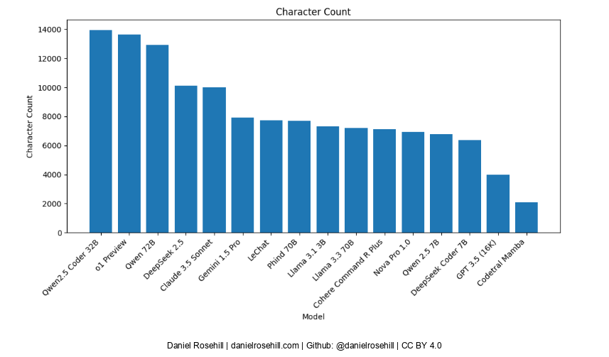
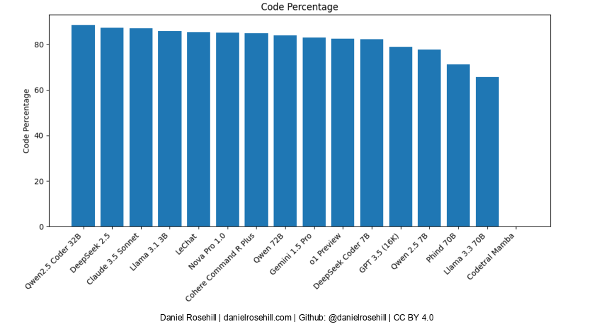
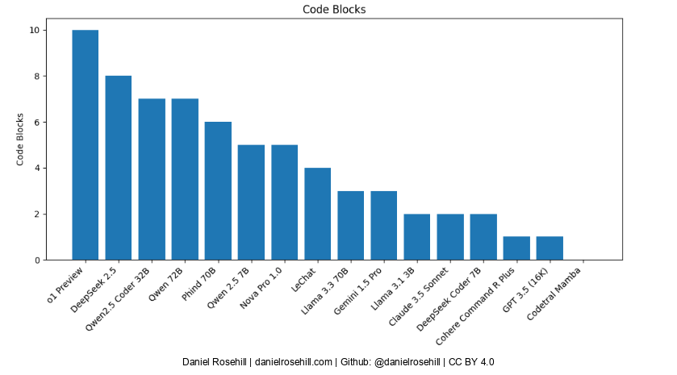

#  LLM Code Generation Test: Long Output Generation

*10-Dec-24*

The purpose of this experiment was to compare and evaluate the capability of different code generation large language models to generate a single long continuous output. 

The prompt used as well as all the outputs are recorded in the data folder. The demanding prompt requested that the LLM assist in the generation of a Open AI Whisper Speech to text transcription GUI for Linux. 

Various large language models were tested across different platforms, including models deployed on Hugging Face, those available via Open Router, and those hosted locally on LM Studio. 

The outputs were recorded in their original form in the outputs folder and a script was used to calculate the character count as well as the percentage of code in the outputs, which was calculated by computing the character count within code fences and comparing that to the total character count in the output. 

Additionally, the number of code blocks within each single output was computed by calculating the number of code blocks in the output. 

Qwen 2.5 Coder generated the longest single output at 13,950 characters, almost 90% of which constituted code spread across five different code blocks.  

Discrepancies between runs on the same platform, and when comparing the same model's output across different access interfaces, were overall quite small. Quen 2.5 when accessed via Open Router via its API yielded an output of 13,159 characters with a code percentage of 82%. This works out to a difference in output length of 5.7 %.

Qwen's larger 72B parameter instruction model generated an output that was almost as long as that of its smaller code specific sibling, 2.5 Coder (12,921 characters, 84% within codefences). 

The lengthiest response among the "Western" models was the one generated by OpenAI's o-1 Preview, accessed via API, which generated 13,622 characters (82% within codefences) and the largest number of unique code blocks at 10. 

## Data Table

| MODEL | ACCESS UI | CHAR COUNT | CODE CHARS | CODE % | CODE BLOCKS |
|-------|-----------|------------|------------|---------|-------------|
| Qwen 2.5 Coder 32B | Hugging Face Chat | 13950 | 12350 | 88.53% | 5 |
| o1 Preview | LibreChat | 13622 | 11221 | 82.37% | 10 |
| Qwen 2.5 Coder 32B | Open Web UI | 13159 | 10822 | 82.24% | 7 |
| Qwen 72B | Hugging Face Chat | 12921 | 10840 | 83.89% | 7 |
| DeepSeek | Online Playground | 10105 | 8820 | 87.28% | 8 |
| Claude 3.5 Sonnet | LibreChat | 10007 | 8705 | 86.99% | 2 |
| Gemini 1.5 Pro | Google AI Studio | 7926 | 6583 | 83.06% | 3 |
| Le Chat | Mistral | 7719 | 6595 | 85.44% | 4 |
| Phind 70B | Site | 7678 | 5474 | 71.29% | 6 |
| Llama 3.1 BB | Local LM | 7321 | 6279 | 85.77% | 2 |
| Llama 3.3 70B | Hugging Face Chat | 7195 | 4718 | 65.57% | 3 |
| Cohere Command R Plus | Hugging Face Chat | 7145 | 6069 | 84.94% | 1 |
| DeepSeek | Chatbox Desktop UI | 7017 | 4297 | 61.24% | 1 |
| Nova Pro 10 | Open Router | 6954 | 5911 | 85.00% | 1 |
| Qwen 2.5 7B | LM Studio | 6773 | 5253 | 77.56% | 5 |
| Nova Pro 10 | Open Router Web UI | 6568 | 5536 | 84.29% | 5 |
| DeepSeek Coder 7B | LM Studio | 6372 | 5246 | 82.33% | 2 |
| GPT-3.5 16K | LibreChat | 3972 | 3129 | 78.78% | 1 |
| Codetral Mamba | Python GUI | 2091 | 0 | 0.00% | 0 |
 
## Charts

## Author

Daniel Rosehill  
(public at danielrosehill dot com)

## Licensing

This repository is licensed under CC-BY-4.0 (Attribution 4.0 International) 
[License](https://creativecommons.org/licenses/by/4.0/)

### Summary of the License
The Creative Commons Attribution 4.0 International (CC BY 4.0) license allows others to:
- **Share**: Copy and redistribute the material in any medium or format.
- **Adapt**: Remix, transform, and build upon the material for any purpose, even commercially.

The licensor cannot revoke these freedoms as long as you follow the license terms.

#### License Terms
- **Attribution**: You must give appropriate credit, provide a link to the license, and indicate if changes were made. You may do so in any reasonable manner, but not in any way that suggests the licensor endorses you or your use.
- **No additional restrictions**: You may not apply legal terms or technological measures that legally restrict others from doing anything the license permits.

For the full legal code, please visit the [Creative Commons website](https://creativecommons.org/licenses/by/4.0/legalcode).